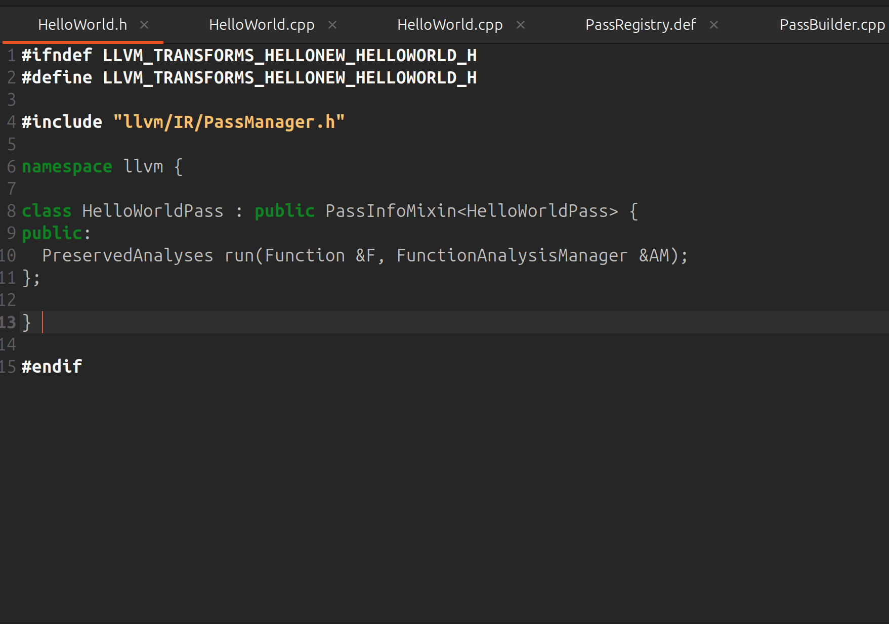
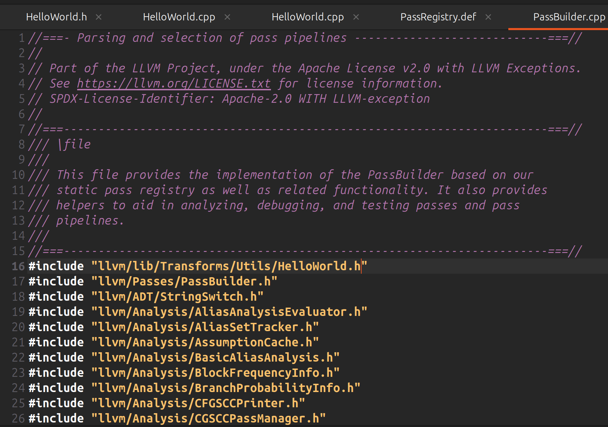
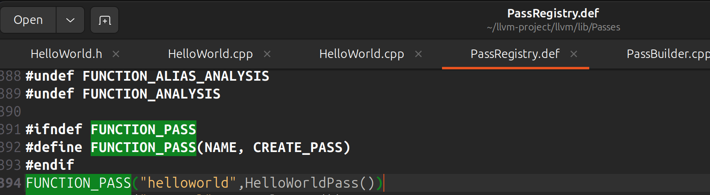
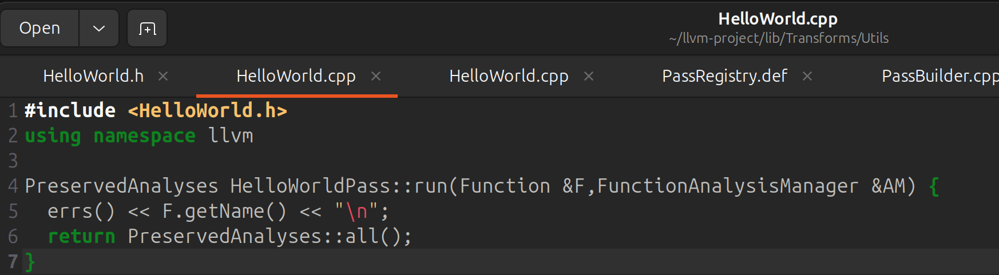
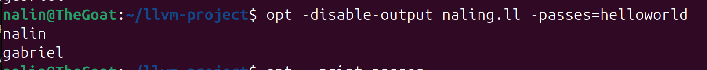

Custom LLVM Pass Created using the LLVM Pass Framework

This project uses the materials provided at : https://llvm.org/docs/WritingAnLLVMNewPMPass.html.
//Done as an introduction to Custom Pass Creation and Optimization Implementation.

clone the LLVM git repo: https://github.com/llvm/llvm-project using git clone https://github.com/llvm/llvm-project.git.

install opt (If not already present - required to run the custom pass on the generated IR):
sudo apt install opt

To create a custom pass using LLVM, you can use a header file to declare the pass (useful if you have multiple passes to run, you can include multiple headers to use different passes). 

In this case the Header File is HelloWorld.h.

Insert the header file inside ~/llvm-project/llvm/lib/Transforms/Utils/CMakeLists.txt - This is necessary to build the pass into llvm itself else you have to create a pass plugin to include when running opt. 
ex : opt insert-pass-plugin /sharedfile.so

The shared file contains the plugin registration and the .cpp file (contains the contents of the pass). Plugins are useful if you want to build passes seperately from the LLVM build itself and not as a part of it.

Include the Header File inside PassBuilder (build/llvm/lib/passes):

Done to insert the pass into the pass pipeline.
Declare the pass in the Pass Registry File : 

Create the .cpp file that contains the pass Operations:

The .cpp file in this case simply prints the names of all the functions in the input IR to stderr.

Run the Pass on an input .ll file using :opt -disable-output yourinputfile.ll -passes=helloworld
to generate the required pass output.

The framework can be used to implement other more Complex Optimizations such as function inlining and loop unrolling.